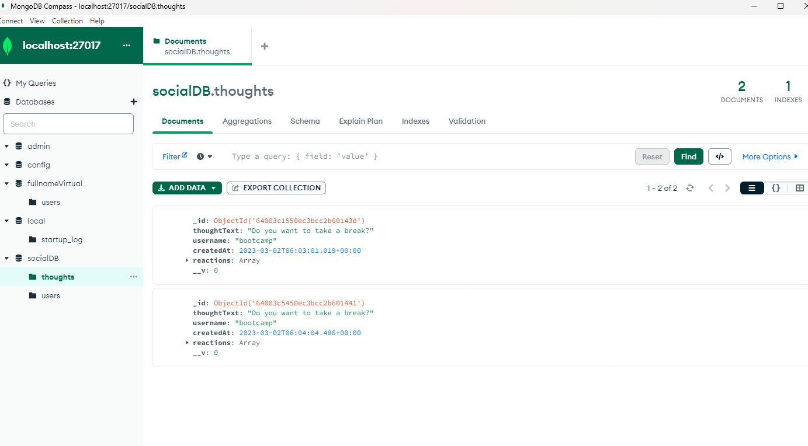
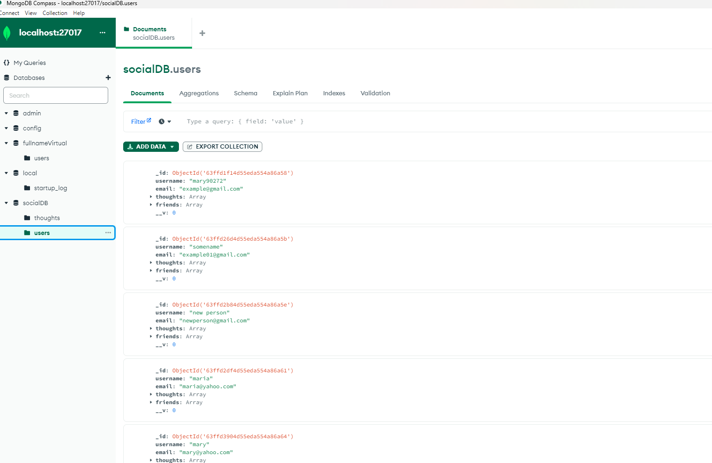
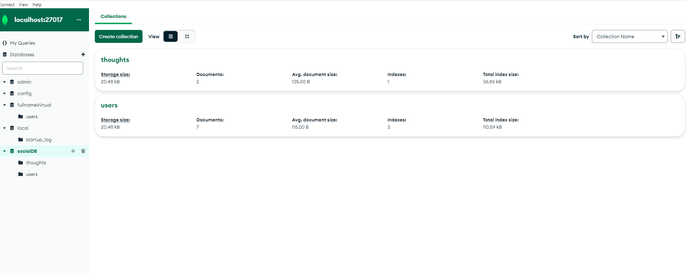
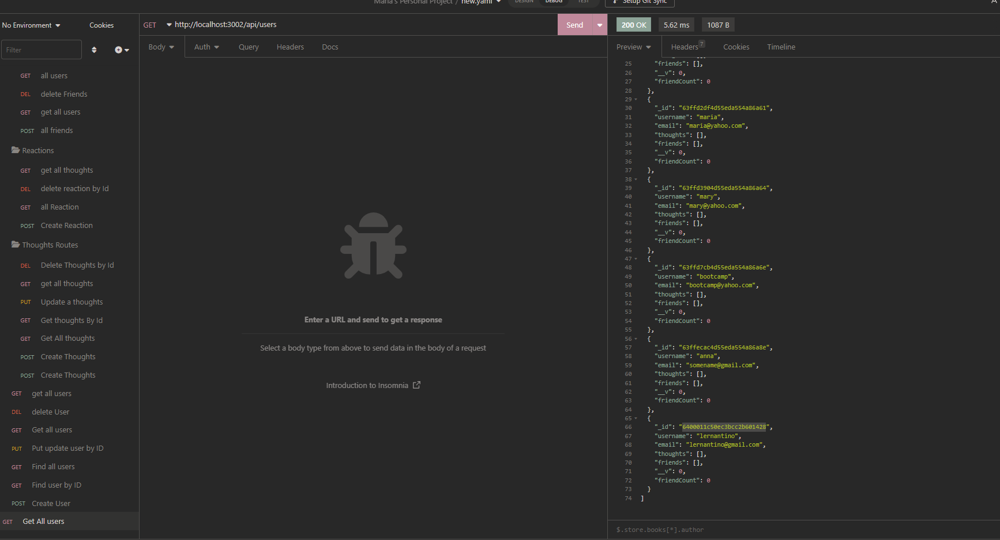
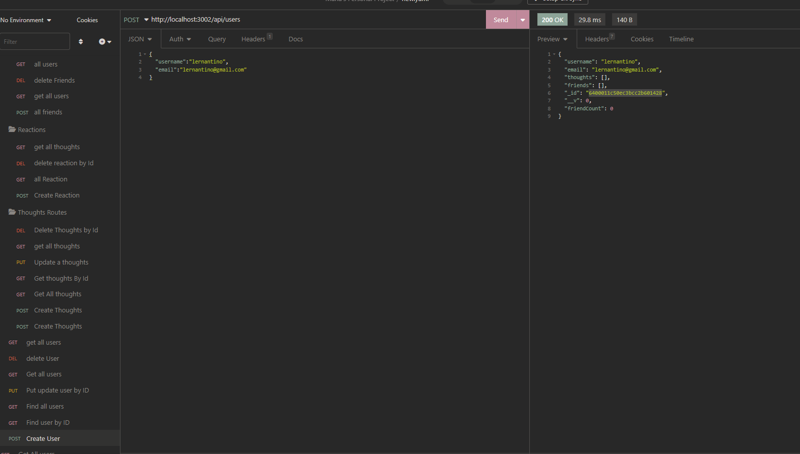
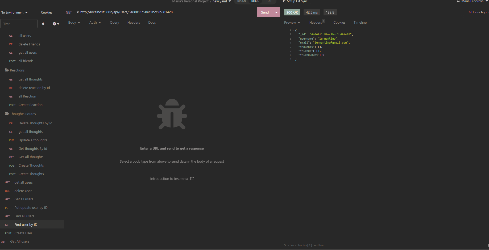
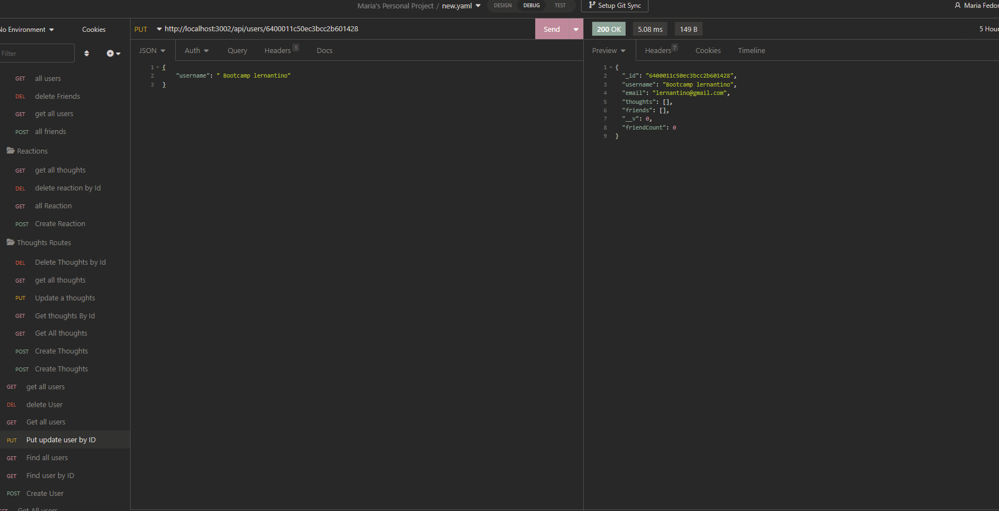
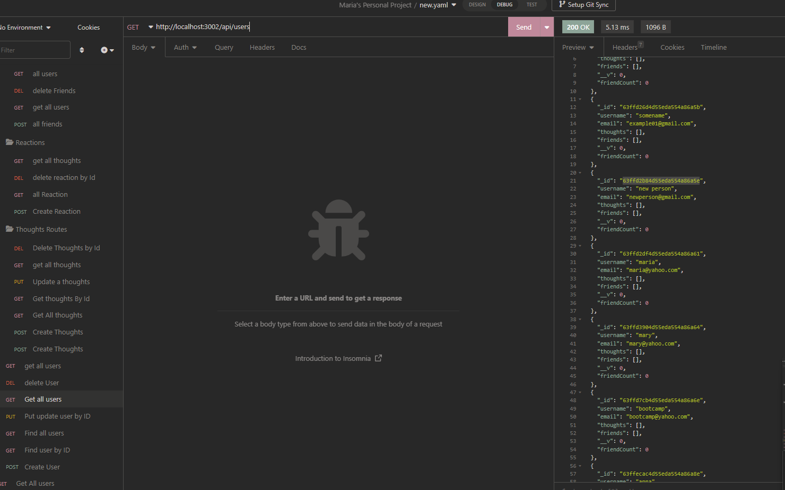

# -Social-Network-API

## Description
This application was build to demonstrate the back-end of a social network application. It contains three models which are the User, the Thoughts and the Reactions.
 It uses Express.js for routing, a MongoDB database, the Mongoose, and Moment.js to format timestamps. The seed data is created using Insomnia.
 ## Installation
Download or clone repository to use this application on local machine. 
Node.js and MongoDB is required to run the application 
To install necessary dependencies, navigate to the root directory and run the following command: npm i 
To run the application, run npm start. 
When the server is started, the Mongoose models are synched to the MongoDB database. 
Open MongoDB and connect to the MongoDB URI mongodb://localhost:27017. On the list of databases, click on socialDB to see thoughts and users data. 
To create seed data and test the API routes, use Insomnia. 
  ## Usage
This is a social network API that uses MongoDB, a NoSQL database, which allows the website to handle large amounts of unstructured data.

When the command to invoke the application is entered, the Mongoose models are synced to the MongoDB database.

When API GET routes for users and thoughts are opened in Insomnia, the data for each of the routes is displayed in formatted JSON.

User, Friend, Thought, and Reaction routes are created to create the database and test the API on Insomnia.

User Routes - a user can create a user with a username and valid email address. When created, the user is assigned a unique user ID.
To create a user, click the POST request and enter the user's username and email address. Click Send.

There are two GET requests that return user information. To return all users, click the Find All Users request, then click on Send. To return a single user, click the Find User by Id request. On the URL, enter the user's ID.

To update a user by ID, click the PUT request. On the URL, enter the ID of the user whose information is going to be updated.

To delete a user by ID, click the DELETE request and enter the user's ID.

A message that reads, "User and thoughts deleted!" will appear if the user has been deleted from the database. If there is no such user or user ID in the system, the message, "No user with this id!" is shown.

Click Find All Users to see if the user has been deleted.

Friend Routes - a user can add a friend and delete a friend.

To add a friend, click the POST request. On the URL enter the user ID of the user who is adding a friend, then the user ID of the friend the user is adding. 

To see the user's friends, click Find All Users. The ID of the friends the user added are listed under "friends". The "friendCount" indicates the number of friends the user added.

To remove or delete a friend, click the DELETE request. On the URL enter the user ID of the user who is deleting a friend, then the user ID of the friend the user is deleting.

To check if the friend has been removed from the user's friend list, click Find All Users.

Thought Routes - a user can create a thought, get all thoughts or a single thought by ID, update a thought by ID, and delete a thought by ID.

## Images of Deployed Application 
Please  to see all images follow by public/assets folder 

# Relevant Links
## Video Link :https://drive.google.com/file/d/15ZNxt2uUDerpQNOnKNI6dAghRpDKV05_/view
## Github Repo: https://github.com/Mary90272/-Social-Network-API
